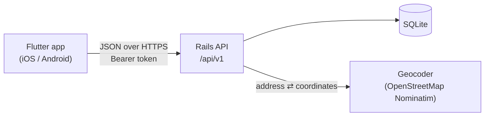
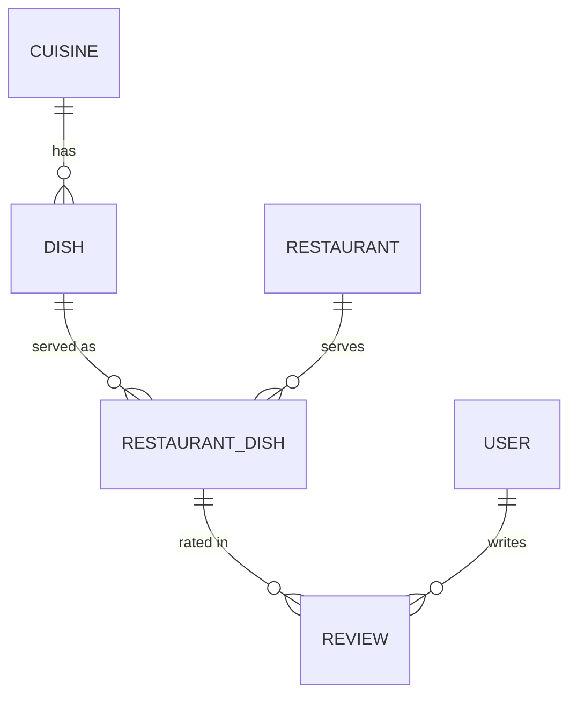

# Baba Yelp

A Yelp-style app about **dishes** rather than restaurants. You pick what you're
craving (say, Pad Thai *and* Tom Yum Soup) and Baba Yelp shows nearby
restaurants that make them, with each dish's own rating. After a meal you rate
the specific dishes you ate, not the restaurant as a whole.

| Part | Stack | Folder |
| --- | --- | --- |
| API | Ruby on Rails 8.1 (API-only) + SQLite | [`backend/`](backend) |
| Phone app | Flutter (Dart), one codebase for iOS and Android | [`mobile/`](mobile) |

**Why Flutter?** One Dart codebase compiles to native ARM code for both iOS and
Android, so the app looks and behaves the same on both. Hot reload makes UI work
fast. It has mature plugins for everything this app needs (location, secure
token storage, maps and phone links), and iOS builds use Swift Package Manager,
so CocoaPods isn't required. React Native would also work; Flutter was chosen
for its consistent rendering and performance on both platforms.

## The two use cases

**1. "I feel like Pad Thai and Tom Yum Soup. Who near Fremont makes them well?"**
On **Discover**, search or browse by cuisine and pick both dishes. The app uses
your location (or tap it and type "Fremont, CA"), then **Find restaurants**
lists places within 10 miles that serve *both* dishes. Each card shows the
distance, a combined rating and each dish's own rating. Two sort orders:

* **Nearest**: sorted by distance, then rating.
* **Top rated**: sorted by rating, then distance.

Distances and ratings are compared as displayed (0.1 mi, 0.1★), so two places
that both show "0.2 mi" are ordered by rating. Filters let you require all or any
of the dishes, show only 4★-and-up places and change the radius.

**2. "I just had great Pad Thai and Tom Yum Soup. Let me review them."**
On **Review** (sign in first), pick the dishes you ate, then find the restaurant.
The app lists nearby places already known to serve those dishes, you can search
by name, or **Add a new restaurant** by address or with "I'm here now" (GPS).
Give each dish 1–5 stars and a few words, then post them together. If the
restaurant wasn't known to serve a dish, it's added to its menu. Reviewing a
dish again later updates your earlier review.

You can also start a review from a restaurant's page or a dish's page, and edit
or delete your reviews from **Profile**.

## Quick start

Prerequisites: Ruby 3.3+, Flutter 3.47+ (Dart 3.13+) with Xcode (iOS) and/or Android Studio
(Android).

```sh
# 1. API with sample data (fictional restaurants around Fremont, CA)
cd backend
bin/setup --skip-server
bin/rails server -b 0.0.0.0          # http://localhost:3000

# 2. App, in another terminal
cd mobile
flutter pub get
open -a Simulator
xcrun simctl location booted set 37.5483,-121.9886   # pretend you're in Fremont
flutter run
```

Sign in with **demo@example.com / password123**, or create an account.

> **Port 3000 busy?** Another app on this machine was already listening on
> `localhost:3000` during development. If that's still the case, run the API
> with `-p 3001` and start the app with
> `flutter run --dart-define=API_BASE_URL=http://localhost:3001`.

The Android emulator reaches your computer at `10.0.2.2` (the app's default
there). On a physical phone, use your computer's LAN address:
`--dart-define=API_BASE_URL=http://192.168.x.x:3000`.

## How it fits together





The key idea is **RestaurantDish**: "Pad Thai at Thai Orchid Kitchen". Reviews
attach to it, and it caches its average rating and review count, so searches
can rank restaurants by how good the dishes you want are. Search filters in
SQL (bounding box, dishes served), then computes exact distances and sorts in
Ruby, which is plenty fast at SQLite scale. The endpoints are documented in
[`backend/README.md`](backend/README.md).

## Tests

```sh
cd backend && bin/ci            # rubocop, bundler-audit, brakeman, 83 tests, seeds
cd mobile && flutter analyze && flutter test
```

`mobile/integration_test/` also walks through both use cases on a simulator
against a real, seeded API (see [`mobile/README.md`](mobile/README.md)).

## Before going to production

* Serve the API over HTTPS and point the app at it. The plain-HTTP allowances
  in the iOS and Android projects are for local development only.
* Nominatim, the free default geocoder, allows about one request per second.
  Configure a commercial provider with `GEOCODER_LOOKUP` / `GEOCODER_API_KEY`.
* Keep the SQLite file on a persistent disk (`DATABASE_PATH`) and back it up.
* Set real app identifiers, icons and signing. Accounts can be deleted in the
  app, which the App Store requires for apps with sign-up.
* "Yelp" is a registered trademark, so pick a different public name before
  publishing.
