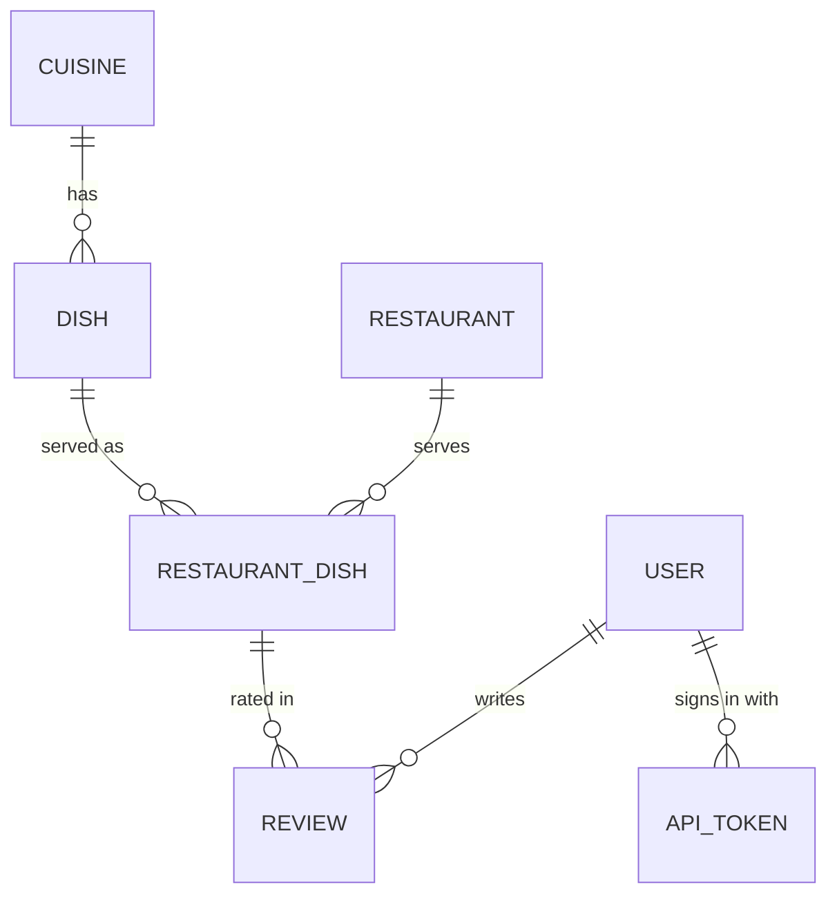

# Baba Yelp API (Rails + SQLite)

JSON API for the Baba Yelp mobile app. Rails 8.1 in API-only mode, SQLite for
storage. See the [root README](../README.md) for the big picture.

## Run it

```sh
bin/setup --skip-server        # install gems, create + migrate + seed the database
bin/rails server -b 0.0.0.0    # http://localhost:3000 (-b 0.0.0.0 lets phones on your network connect)
```

Port 3000 taken? `bin/rails server -b 0.0.0.0 -p 3001`, then point the app at it
(`--dart-define=API_BASE_URL=http://localhost:3001`).

`bin/rails db:reset` wipes the database and reloads the sample data. Every demo
account uses the password `password123`; `demo@example.com` starts with no
reviews.

## Test it

```sh
bin/rails test   # models, services and API requests
bin/ci           # setup, rubocop, bundler-audit, brakeman, tests, seeds
```

## Configuration

| Variable | Default | Purpose |
| --- | --- | --- |
| `GEOCODER_LOOKUP` | `nominatim` | Geocoding provider ([geocoder gem](https://github.com/alexreisner/geocoder) lookup name). Nominatim (OpenStreetMap) is free but limited to ~1 request/second, so use a commercial provider in production. |
| `GEOCODER_API_KEY` | none | API key for the chosen provider. |
| `GEOCODER_USER_AGENT` | `BabaYelp/1.0 (…)` | Identifies the app to Nominatim, as its usage policy requires. |
| `CORS_ORIGINS` | `*` outside production | Comma-separated browser origins allowed to call the API. Only the web build needs this; the phone apps aren't subject to CORS. |
| `DATABASE_PATH` | `storage/production.sqlite3` | Production database file. Keep it on a persistent volume. |

## Data model



* **Dish**: a catalog entry such as "Pad Thai" (Thai). Aliases ("Phat Thai")
  help search.
* **RestaurantDish**: a dish as served by one restaurant. This is what gets
  rated. It caches `average_rating` and `reviews_count`, refreshed whenever a
  review changes.
* **Review**: 1–5 stars plus optional text. One per user per restaurant dish;
  reviewing again replaces it.
* **ApiToken**: bearer tokens for the app. Only a SHA-256 digest is stored.

## Endpoints

All endpoints live under `/api/v1` and speak JSON. Endpoints marked 🔒 need
`Authorization: Bearer <token>`. Lists are paginated with `page` and `per_page`
and return a `meta` object (`page`, `per_page`, `total_count`, `total_pages`).
Errors look like `{ "error": "message", "errors": { "field": ["message"] } }`.

### Accounts

| Method | Path | Notes |
| --- | --- | --- |
| POST | `/users` | Sign up: `{ "user": { "name", "email", "password" } }` → `{ token, user }` |
| POST | `/session` | Sign in: `{ "email", "password" }` → `{ token, user }` |
| DELETE | `/session` 🔒 | Sign out (revokes the token) |
| GET | `/me` 🔒 | Your profile and review count |
| GET | `/me/reviews` 🔒 | Your reviews, newest first. Optional `restaurant_id` filter. |
| DELETE | `/me` 🔒 | Delete your account and reviews: `{ "password" }` |

### Dishes

| Method | Path | Notes |
| --- | --- | --- |
| GET | `/cuisines` | All cuisines with dish counts |
| GET | `/dishes` | `q` searches names, aliases and cuisines; `cuisine_id` filters |
| GET | `/dishes/:id` | One dish |
| POST | `/dishes` 🔒 | Add a dish: `{ "dish": { "name", "cuisine_id", "aliases", "description" } }` |

### Restaurants and search

`GET /restaurants` is the search behind both use cases:

| Param | Meaning |
| --- | --- |
| `dish_ids` | Dishes you want: `11,12` or `dish_ids[]=11&dish_ids[]=12` (max 10) |
| `match` | `all` (default): the restaurant must serve every dish. `any`: at least one. |
| `lat`, `lng` | Search location. Adds `distance_miles` to each result. |
| `radius` | Miles from the location (default 10, max 100) |
| `sort` | `distance` (default): nearest first, then best rated. `rating`: best rated first, then nearest. |
| `min_rating` | Only restaurants rated at least this high |
| `q` | Restaurant name contains |

Each result carries `distance_miles`, the combined `rating` of the searched
dishes (the average of each dish's own average, so every dish counts equally),
`reviews_count`, and `dishes`: every searched dish the restaurant serves, with
its own `average_rating` and `reviews_count`.

Distances and ratings are compared at the precision the app shows them (0.1 mi,
0.1 stars). So "distance, then rating" puts a 4.6★ place ahead of a 3.8★ place
when both are shown as 0.2 mi away.

| Method | Path | Notes |
| --- | --- | --- |
| GET | `/restaurants/:id` | Restaurant with its whole menu, best rated first. Pass `lat`/`lng` for distance. |
| POST | `/restaurants` 🔒 | `{ "restaurant": { "name", "address", "city", "state", "zip_code", "phone", "latitude", "longitude" } }`. Without coordinates the address is geocoded. Returns **409** with the existing `restaurant` if one with the same name is within 0.1 mi. |
| POST | `/restaurant_dishes` 🔒 | Add a dish to a menu: `{ "restaurant_id", "dish_id" }`. Returns 201, or 200 if it's already there. |
| GET | `/restaurant_dishes/:id` | Dish at a restaurant: rating, `rating_distribution` and (when signed in) `my_review` |

### Reviews

| Method | Path | Notes |
| --- | --- | --- |
| POST | `/restaurants/:id/reviews` 🔒 | Review several dishes eaten at one restaurant: `{ "reviews": [ { "dish_id", "rating", "body" } ] }`. Dishes not yet on the menu are added. Reviewing a dish again replaces your earlier review. All are saved, or none (422 lists each dish's errors). |
| GET | `/restaurant_dishes/:id/reviews` | Reviews, newest first |
| PATCH | `/reviews/:id` 🔒 | Edit your review: `{ "review": { "rating", "body" } }` |
| DELETE | `/reviews/:id` 🔒 | Delete your review |

### Places

| Method | Path | Notes |
| --- | --- | --- |
| GET | `/geocode?q=Fremont, CA` | Places matching a city, address or ZIP |
| GET | `/geocode/reverse?lat=&lng=` | Address at a point (used for "I'm here now") |

`GET /up` is a health check.
